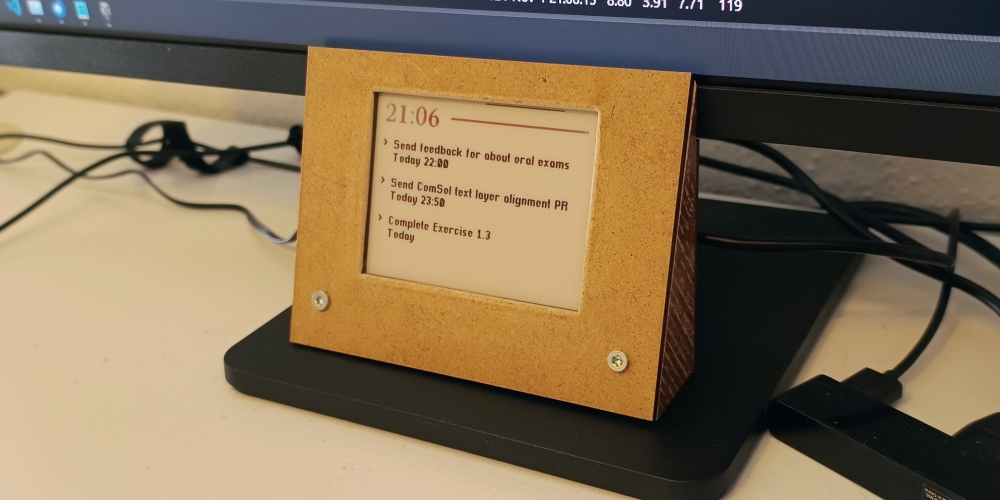
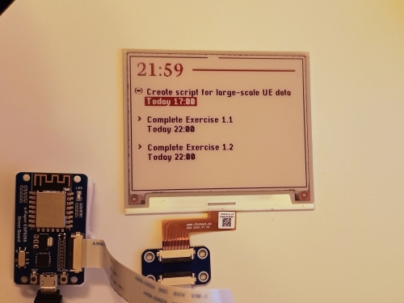
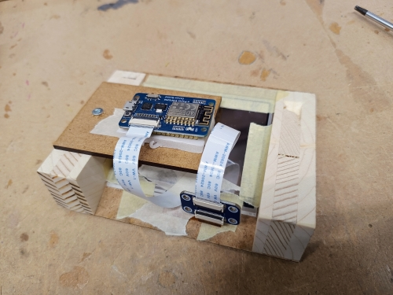

# Desktop E-Paper Todoist Display

This project is a simple way to display my Todoist tasks on an e-paper display. The display is updated every 30 seconds with the current time, and every 5 minutes with the latest tasks from my Todoist account.

The project is built using a cheap 4.2-inch Waveshare e-paper display, and an ESP8266 WaveShare e-paper driver board, and the Todoist API.

> [!IMPORTANT]
> This is a personal project that's released as open-source. I'll try to help when requested, but generally this repository is a stash of my own code and probably won't work as-is if you intend to use it for your own displays/boards.
>
> Also, I don't think I fully understand LUTs for e-ink displays yet, so I'm not sure if my driver code is correct. Please be warned if you want to use this repo as a reference!

------

### Pictures

| Programming the Display | Woodwork & Tapework |
| -- | -- |
|  |  |
